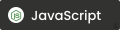
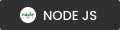

### Hello there 👋
I'm :boy:IMRUL KAYES, a Frontend Web Developer from Bangladesh. I spend most of my time coding outstanding projects and learning new code.

### :computer: Connect with me!
 
 
 
 
 
 
 

<g-emoji class="g-emoji" alias="hearts" fallback-src="https://github.githubassets.com/images/icons/emoji/unicode/2665.png">♥️</g-emoji>  I enjoy programming and sharing knowledge  
<g-emoji class="g-emoji" alias="computer" fallback-src="https://github.githubassets.com/images/icons/emoji/unicode/1f4bb.png">💻</g-emoji>  Most used line of code <code>console.log("hello world")</code>  
<g-emoji class="g-emoji" alias="thinking" fallback-src="https://github.githubassets.com/images/icons/emoji/unicode/1f914.png">🤔</g-emoji>  I’m looking for people who can help me with Outstanding Video ideas and executions. 
<g-emoji class="g-emoji" alias="email" fallback-src="https://github.githubassets.com/images/icons/emoji/unicode/1f4e7.png">📧</g-emoji>  How to reach me: <a href="mailto:emimrulkayes@gmail.com">emimrulkayes@gmail.com</a>. 
<g-emoji class="g-emoji" alias="zap" fallback-src="https://github.githubassets.com/images/icons/emoji/unicode/26a1.png">

### Things I code with:

<!--
**emimrulkayes/emimrulkayes** is a ✨ _special_ ✨ repository because its `README.md` (this file) appears on your GitHub profile.

Here are some ideas to get you started:

- 🔭 I’m currently working on ...
- 🌱 I’m currently learning ...
- 👯 I’m looking to collaborate on ...
- 🤔 I’m looking for help with ...
- 💬 Ask me about ...
- 📫 How to reach me: ...
- 😄 Pronouns: ...
- ⚡ Fun fact: ...
-->
